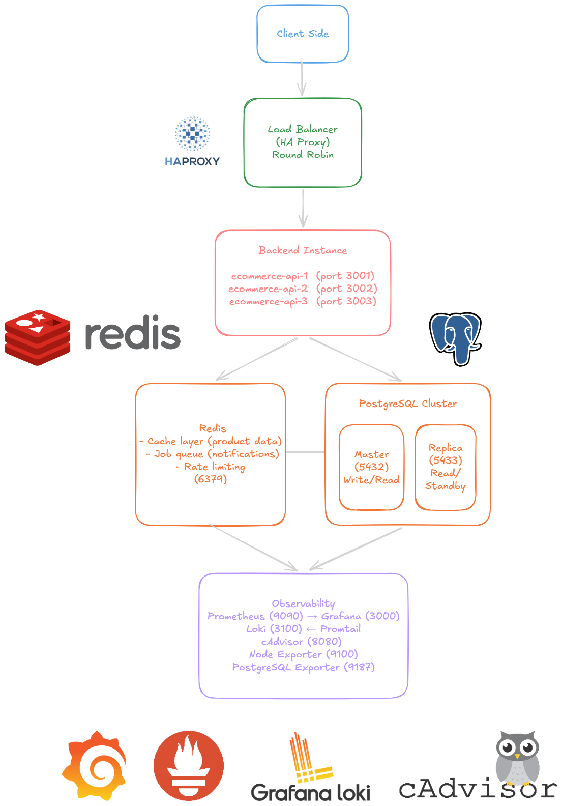
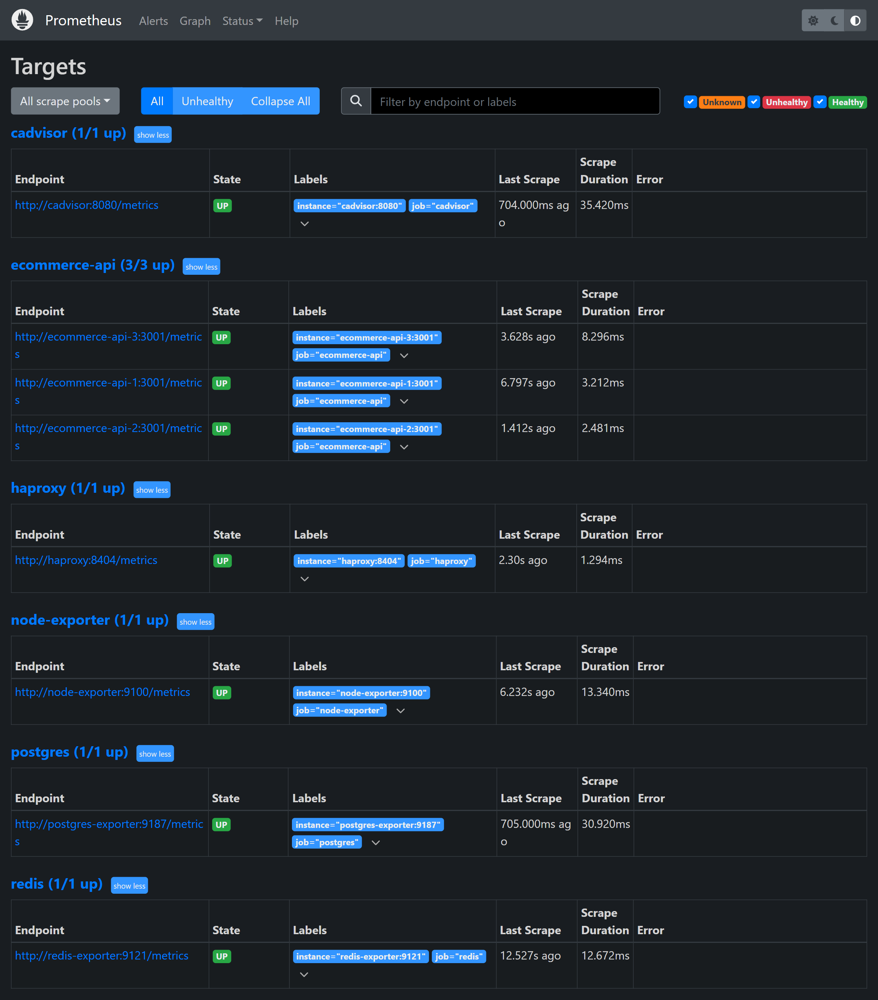

# E-Commerce HA Backend

High-availability e-commerce backend built with Fastify, TypeScript, PostgreSQL, Redis, HAProxy, Prometheus, Grafana, and Loki. This project is designed as a portfolio-grade backend system that demonstrates API reliability, failover behavior, database-backed business flows, and production-style observability.

## Architecture



The stack runs three API instances behind HAProxy. PostgreSQL runs as a repmgr-managed primary/standby pair behind Pgpool, Redis is used for queue/cache infrastructure, Prometheus scrapes application and infrastructure metrics, Grafana visualizes the system, and Loki stores container logs collected by Promtail.

## What This Demonstrates

- Fastify API with TypeScript and layered modules.
- HAProxy load balancing across `api-1`, `api-2`, and `api-3`.
- PostgreSQL primary/standby failover with repmgr and Pgpool.
- Health checks with PostgreSQL and Redis dependency checks.
- Checkout flow with transactional database boundaries.
- Idempotent payment webhook handling with HMAC signature validation.
- Prometheus metrics for HTTP, checkout, payment, HAProxy, containers, host, PostgreSQL, and Redis.
- Grafana dashboard provisioning from JSON.
- Loki log exploration through Grafana.
- Docker Compose infrastructure for local HA and observability testing.

## Main Endpoints

| Method | Path | Purpose |
| --- | --- | --- |
| `GET` | `/health` | API health check with database and Redis status |
| `GET` | `/metrics` | Prometheus metrics endpoint |
| `POST` | `/checkout` | Create checkout from seeded cart data |
| `POST` | `/webhook/payment` | Handle signed payment gateway webhook |

## Observability

Grafana dashboard:

.png>)

Prometheus targets:



The dashboard includes:

- API request rate, error ratio, and latency.
- Checkout attempts, successes, failures, and success ratio.
- Payment webhook volume and state transitions.
- HAProxy backend health and response rate.
- Container CPU, memory, and restart panels with readable container names.
- PostgreSQL connections, transactions, locks, and replication lag.
- Redis memory, clients, cache hit ratio, and keys.
- Host CPU, memory, disk, network, and uptime.
- Loki-backed API and infrastructure logs.

## Local Requirements

- Node.js 22+
- Docker and Docker Compose
- Git Bash, WSL, Linux, or macOS shell for the example commands

## Run Locally

Create the local environment file:

```bash
cp .env.example .env
```

Install dependencies:

```bash
npm install
```

Run unit and integration-style tests:

```bash
npm test
```

Build the TypeScript project:

```bash
npm run build
```

Start the full stack:

```bash
docker compose up --build
```

### Safer Docker Compose Startup

PostgreSQL replication and Redis can take longer to become healthy on the first run. If `docker compose up --build` races dependency health checks on your machine, start the stack in phases:

```bash
docker compose up -d --build postgres-primary redis
```

Wait until both are healthy:

```bash
docker compose ps postgres-primary redis
```

Then start the standby and Pgpool:

```bash
docker compose up -d postgres-standby postgres-pgpool
```

Wait until both are healthy:

```bash
docker compose ps postgres-standby postgres-pgpool
```

Then start the API layer:

```bash
docker compose up -d --build ecommerce-api-1 ecommerce-api-2 ecommerce-api-3 haproxy
```

Finally start observability services:

```bash
docker compose up -d prometheus grafana loki promtail cadvisor container-name-exporter node-exporter redis-exporter postgres-exporter
```

Check the app:

```bash
curl http://localhost/health
```

For a clean rebuild without deleting volumes:

```bash
docker compose up -d --build --remove-orphans
```

Only use this when you intentionally want to reset database and Grafana data:

```bash
docker compose down -v --remove-orphans
```

## Useful URLs

| Service | URL | Notes |
| --- | --- | --- |
| API through HAProxy | `http://localhost/health` | Load balanced API entrypoint |
| API instance 1 | `http://localhost:3001/health` | Direct instance check |
| API instance 2 | `http://localhost:3002/health` | Direct instance check |
| API instance 3 | `http://localhost:3003/health` | Direct instance check |
| PostgreSQL via Pgpool | `localhost:5432` | Stable database endpoint |
| PostgreSQL standby | `localhost:5433` | Direct standby node access |
| PostgreSQL initial primary | `localhost:5434` | Direct initial primary node access |
| Grafana | `http://localhost:3000` | Default local credentials: `admin` / `admin` |
| Prometheus | `http://localhost:9090` | Targets and PromQL |
| HAProxy stats | `http://localhost:8404/stats` | Backend state and traffic |
| HAProxy metrics | `http://localhost:8404/metrics` | Prometheus exporter endpoint |
| Loki | `http://localhost:3100` | Log storage API |

## Smoke Tests

Check the load-balanced health endpoint:

```bash
curl http://localhost/health
```

Generate traffic through HAProxy:

```bash
for i in {1..20}; do
  curl -s -o /dev/null -w "%{http_code}\n" http://localhost/health
done
```

Check exported API metrics:

```bash
curl -s http://localhost:3001/metrics \
  | grep -E "http_requests_total|http_request_duration_seconds|checkout_|payment_"
```

Run a checkout using seeded data:

```bash
curl -X POST http://localhost/checkout \
  -H "content-type: application/json" \
  -d '{"userId":"00000000-0000-0000-0000-000000000001"}'
```

## API Failover Demo

Stop one API instance:

```bash
docker compose stop ecommerce-api-2
```

Send traffic through HAProxy:

```bash
for i in {1..20}; do
  curl -s -o /dev/null -w "%{http_code}\n" http://localhost/health
done
```

Start the instance again:

```bash
docker compose start ecommerce-api-2
```

Confirm HAProxy sees it as healthy again:

```bash
curl -s http://localhost:8404/metrics \
  | grep 'haproxy_server_status{proxy="ecommerce_api",server="api2",state="UP"}'
```

Expected value after the health check recovers:

```text
haproxy_server_status{proxy="ecommerce_api",server="api2",state="UP"} 1
```

## PostgreSQL Failover Demo

The API connects to Pgpool instead of a specific PostgreSQL node:

```text
API -> postgres-pgpool -> active PostgreSQL primary
```

In the normal state, `postgres-primary` is primary and `postgres-standby` is read-only. When `postgres-primary` is stopped, repmgr promotes `postgres-standby` and Pgpool routes new database connections to it.

Check Pgpool node status:

```bash
docker exec -e PGPASSWORD=ecommerce_password postgres-pgpool \
  psql -h 127.0.0.1 -U ecommerce -d ecommerce -c "SHOW pool_nodes;"
```

Simulate the initial primary going down:

```bash
docker compose stop postgres-primary
```

Poll API health until promotion completes:

```bash
for i in {1..30}; do
  curl -s -o /dev/null -w "%{http_code}\n" http://localhost/health
  sleep 3
done
```

Verify the promoted node accepts writes:

```bash
curl -X POST http://localhost/checkout \
  -H "content-type: application/json" \
  -d '{"userId":"00000000-0000-0000-0000-000000000001"}'
```

There can be a short transient failure window while repmgr promotes the standby and Pgpool detaches the old primary. After promotion, the API should recover through `postgres-pgpool` without changing `DATABASE_URL`.

### Rejoin the Old Primary

Do not start the old `postgres-primary` as a primary again after failover. Rejoin it as a fresh standby instead:

```text
After failover:
postgres-standby = primary
postgres-primary = stale old primary

After rejoin:
postgres-standby = primary
postgres-primary = standby
```

Run the controlled rejoin script:

```bash
./scripts/postgres-rejoin-primary.sh
```

The script removes the stale `postgres-primary` volume, starts `postgres-primary` again, waits until it reports `pg_is_in_recovery() = true`, recreates Pgpool, and prints `SHOW pool_nodes;`.

Expected final shape:

```text
postgres-standby  primary
postgres-primary  standby
```

## Project Structure

```text
src/
  modules/              Fastify feature modules for checkout and payments
  shared/               Database, Redis, queue, and error utilities
  metrics/              Prometheus metric registration and recorders
database/init/          PostgreSQL schema and seed data
infra/
  grafana/              Datasource and dashboard provisioning
  haproxy/              Load balancer config
  prometheus/           Scrape config
  loki/                 Loki config
  promtail/             Log collector config
  container-name-exporter/
scripts/                Operational scripts for local HA demos
docs/                   Architecture and observability screenshots
tests/                  Vitest test suite
```

## Notes

The stack is intentionally local-first. It uses Docker Compose to make failover, metrics, and logs easy to demonstrate on a development machine without requiring Kubernetes or cloud infrastructure.
